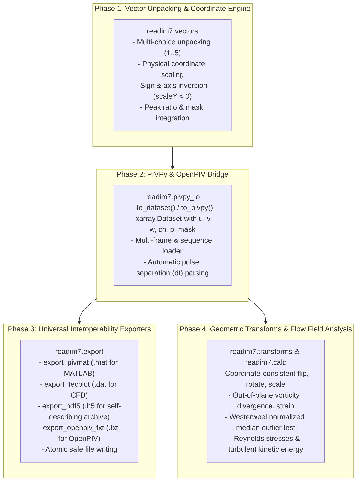

# readim7 Enhancement Plan: Modern PIV Ecosystem Bridge (PIVPy, OpenPIV, Interoperability)

## Motivation & Vision

`readim7` provides high-performance C++ bindings to read and write native LaVision DaVis file formats (`.im7`, `.vc7`, `.ims`). However, modern scientific workflows in fluid mechanics and experimental aerodynamics have evolved:
- **PIVPy** standardizes PIV analysis on `xarray.Dataset` (multidimensional labelled arrays with physical coordinates and coordinates-aware plotting).
- **OpenPIV** provides open-source PIV algorithms and requires straightforward vector table representations.
- Researchers routinely need to bridge data between DaVis, MATLAB (`PIVMAT`), CFD/visualization tools (`Tecplot`, `ParaView`), and long-term archival formats (`HDF5`).

By synthesizing best practices from five key open-source PIV projects (`libim7`, `libim7-py3`, `pyFlowStat`, `python-PIVTOOLs`, and `jpiv`), this enhancement transforms `readim7` into a versatile, high-level bridge for the global PIV community while preserving its ultra-fast C++ foundation.

---

## Architectural Roadmap: 4 Phases

---

## Phase 1: Vector Field Extraction & Physical Coordinate Engine

**Goal**: Seamlessly decode raw multi-component DaVis vector buffers into structured, physically scaled velocity fields ($u, v, w$) and spatial coordinate grids ($x, y$).

### Key Capabilities:
1. **Multi-Component Vector Unpacking**:
   - Support for all DaVis vector formats:
     - `BUFFER_FORMAT_VECTOR_2D` (format 2: 2 components)
     - `BUFFER_FORMAT_VECTOR_2D_EXTENDED` (format 1: 9 components: choice map + 4 peak choices)
     - `BUFFER_FORMAT_VECTOR_2D_EXTENDED_PEAK` (format 3: 10 components: choice map + 4 peak choices + peak ratio)
     - `BUFFER_FORMAT_VECTOR_3D` (format 4: 3 components for stereoscopic PIV)
     - `BUFFER_FORMAT_VECTOR_3D_EXTENDED_PEAK` (format 5: 14 components: choice map + 4 peak choices + peak ratio)
2. **Intelligent Vector Choice Selection**:
   - Follow choice map (`1..4` correlation peaks, `5` post-processed/interpolated).
   - Support optional override to force 1st-choice peak inspection.
3. **Physical Space Calibration**:
   - Calculate exact window center coordinates:
     $$x_i = (i + 0.5) \cdot \text{vector\_grid} \cdot \text{scaleX.factor} + \text{scaleX.offset}$$
     $$y_j = (j + 0.5) \cdot \text{vector\_grid} \cdot \text{scaleY.factor} + \text{scaleY.offset}$$
   - When $\text{scaleY.factor} < 0$, invert row ordering and vertical velocity component $v \to -v$ to ensure standard Cartesian coordinates (origin bottom-left, positive $y$ upwards).
4. **Structured Representation**:
   - Return clean dataclass `VectorField` with properties for `extent`, `vmag`, `units`, and metadata.

---

## Phase 2: Native PIVPy & OpenPIV Bridge

**Goal**: Expose a first-class, one-line API converting any DaVis file into an `xarray.Dataset` compliant with PIVPy conventions.

### Key Capabilities:
1. **`readim7.to_dataset()` / `readim7.to_pivpy()`**:
   - Coordinates: `x`, `y`, and `t` (time/frame).
   - Variables: `u`, `v`, optional `w`, `ch` (choice), `p` (peak ratio), `mask`.
   - Attributes: `units = ['mm', 'mm', 'm/s', 'm/s']`, `dt` (in seconds), DaVis header attributes preserved.
2. **Image Support**:
   - Directly converts `.im7` frames into `xarray.Dataset` with intensity variables, frame indices, and spatial scaling.
3. **High-Speed Camera Stream Support**:
   - Directly loads `.ims` camera streams into `xarray.Dataset` with pulse pairs.
4. **Sequence Loader (`readim7.load_sequence()`)**:
   - Automatically loads batches of files and concatenates them along the time coordinate `t`.

---

## Phase 3: Universal Interoperability Exporters

**Goal**: Provide direct export from `readim7` data structures to the major formats in experimental fluid mechanics.

### Key Capabilities:
1. **PIVMAT Export (`readim7.export_pivmat`)**:
   - Exports directly to MATLAB `.mat` compatible with the widely used PIVMAT toolbox (`vx`, `vy`, `vz`, `choice`, `ysign`, `unitx`, `unity`, `unitvx`).
2. **Tecplot Export (`readim7.export_tecplot`)**:
   - Exports standard ASCII `.dat` format with `TITLE`, `VARIABLES = "X", "Y", "U", "V", "W", "Vmag", "Choice", "Mask"`, and `ZONE I=nx, J=ny, F=POINT`.
3. **Hierarchical HDF5 Export (`readim7.export_hdf5`)**:
   - Compressed, self-describing archival format using `h5py` storing velocity fields, coordinates, masks, and metadata.
4. **OpenPIV Export (`readim7.export_openpiv_txt`)**:
   - Tab-separated 5-column ASCII format (`x y u v mask`).
5. **Atomic File Safety**:
   - Write via temporary files and atomic rename to protect against corruptions during batch writes.

---

## Phase 4: Geometric Transforms & Flow Field Analysis

**Goal**: Provide coordinate-consistent transformations, spatial derivations, and quality filtering directly in Python.

### Key Capabilities:
1. **Pure Vector Transforms (`readim7.transforms`)**:
   - Synchronously transforms coordinates and velocity components:
     - `flip_ud`: rows inverted, $v \to -v$
     - `flip_lr`: cols inverted, $u \to -u$
     - `rotate_90_cw`, `rotate_90_ccw`, `rotate_180`
     - `swap_uv`, `invert_uv`, `scale_coords`, `scale_velocity`
     - Chained pipeline via `transform(data, operations)`
2. **Differential Field Calculations (`readim7.calc`)**:
   - Out-of-plane vorticity: $\omega_z = \frac{\partial v}{\partial x} - \frac{\partial u}{\partial y}$
   - 2D divergence: $\nabla \cdot \vec{u} = \frac{\partial u}{\partial x} + \frac{\partial v}{\partial y}$
   - Shear strain rate: $\frac{1}{2}\left(\frac{\partial u}{\partial y} + \frac{\partial v}{\partial x}\right)$
3. **Turbulent Statistics (`readim7.calc_turbulent_statistics`)**:
   - Reynolds normal stresses $\overline{u'^2}, \overline{v'^2}, \overline{w'^2}$
   - Reynolds shear stress $\overline{u'v'}$
   - Turbulent kinetic energy $k = \frac{1}{2}(\overline{u'^2} + \overline{v'^2} + \overline{w'^2})$
4. **Universal Outlier Detection (`readim7.normalized_median_filter`)**:
   - Westerweel & Scarano (2005) normalized median test for PIV vector validation.

---

## References & Learned Repositories
- `libim7` & `libim7-py3`: https://github.com/alexlib/libim7-py3 (PIVMAT export, DaVis choice buffer structure)
- `pyFlowStat`: https://github.com/alexlib/pyFlowStat (Cartesian surface model, HDF5 persistence, quadrant analysis)
- `python-PIVTOOLs`: https://github.com/alexlib/python-PIVTOOLs (Atomic I/O, coordinate-consistent transforms)
- `jpiv`: https://github.com/alexlib/jpiv (Tecplot export, differential calculus, normalized median test)
